# 🐙 ArgoCD — The Complete Practical Guide (Zero to Advanced)


> **Your Git repository is the source of truth. ArgoCD's only job is to make your Kubernetes cluster look exactly like what's in Git — automatically, continuously, forever.**

---

## 📖 Table of Contents

1. [What is ArgoCD?](#what-is-argocd)
2. [What is GitOps? (The Idea Behind ArgoCD)](#what-is-gitops-the-idea-behind-argocd)
3. [How ArgoCD Actually Works — Architecture](#how-argocd-actually-works--architecture)
4. [Core Concepts You Must Know](#core-concepts-you-must-know)
5. [Installing ArgoCD From Scratch](#installing-argocd-from-scratch)
6. [Accessing the ArgoCD UI](#accessing-the-argocd-ui)
7. [Installing the ArgoCD CLI](#installing-the-argocd-cli)
8. [Your First Application — Step by Step](#your-first-application--step-by-step)
9. [Understanding Sync Policies](#understanding-sync-policies)
10. [Sync Status vs Health Status](#sync-status-vs-health-status)
11. [The "App of Apps" Pattern](#the-app-of-apps-pattern)
12. [ApplicationSets — Managing Many Apps/Clusters](#applicationsets--managing-many-appsclusters)
13. [Sync Waves & Hooks — Ordering Your Deployment](#sync-waves--hooks--ordering-your-deployment)
14. [Real-World Use Case 1: Dev → Staging → Prod](#real-world-use-case-1-dev--staging--prod)
15. [Real-World Use Case 2: Multi-Cluster Fleet Management](#real-world-use-case-2-multi-cluster-fleet-management)
16. [Real-World Use Case 3: Microservices Monorepo](#real-world-use-case-3-microservices-monorepo)
17. [Real-World Use Case 4: Canary / Blue-Green with Argo Rollouts](#real-world-use-case-4-canary--blue-green-with-argo-rollouts)
18. [ArgoCD vs Jenkins vs GitHub Actions — When to Use What](#argocd-vs-jenkins-vs-github-actions--when-to-use-what)
19. [The Hybrid Pattern: CI Tool + ArgoCD Together](#the-hybrid-pattern-ci-tool--argocd-together)
20. [Full Worked Example: GitHub Actions + ArgoCD Pipeline](#full-worked-example-github-actions--argocd-pipeline)
21. [Notifications (Slack, Email, etc.)](#notifications-slack-email-etc)
22. [RBAC & SSO](#rbac--sso)
23. [Security Best Practices](#security-best-practices)
24. [Debugging: My App is OutOfSync / Degraded](#debugging-my-app-is-outofsync--degraded)
25. [Cheat Sheet](#cheat-sheet)

---

## What is ArgoCD?

**ArgoCD** is a **declarative, GitOps continuous delivery tool for Kubernetes**. In plain English:

> You describe *what your application should look like* (Deployments, Services, ConfigMaps, Helm charts, Kustomize overlays...) in a Git repository. ArgoCD constantly watches that repository, and whenever it changes, it automatically updates your Kubernetes cluster to match.

No `kubectl apply` from your laptop. No SSH-ing into servers. No CI pipeline needing cluster credentials. **Git is the single source of truth**, and ArgoCD is the robot that keeps reality in sync with it.

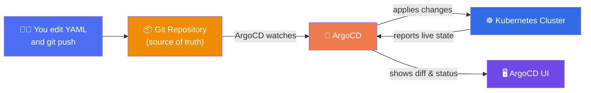

> [!NOTE]
> Notice the arrow direction: ArgoCD **pulls** from Git and **pushes into** the cluster from *inside* the cluster. Nothing external ever needs direct write-access to your cluster. This is the core security advantage of GitOps over traditional CI/CD deployment.

---

## What is GitOps? (The Idea Behind ArgoCD)

GitOps is a philosophy, and ArgoCD is one tool that implements it. The rules are simple:

| Traditional CI/CD Deploy | GitOps (ArgoCD) Deploy |
|---|---|
| CI pipeline runs `kubectl apply` at the end of a build | CI pipeline only updates a YAML file in Git |
| CI tool needs cluster credentials (security risk) | Cluster credentials never leave the cluster |
| "What's actually running?" — you have to check the cluster | "What's actually running?" — you just read Git |
| Rollback = re-run an old pipeline | Rollback = `git revert` |
| Push-based (something pushes changes in) | Pull-based (ArgoCD pulls changes from Git) |

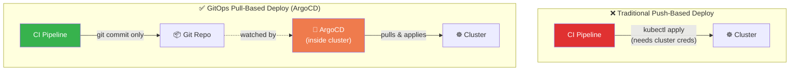

> [!TIP]
> Because Git already has commit history, PR reviews, and `git revert`, GitOps gives you a **full audit trail and instant rollback** for free — no extra tooling required.

---

## How ArgoCD Actually Works — Architecture

ArgoCD runs *inside* your Kubernetes cluster as a set of pods (it's not an external SaaS by default — though a hosted version exists too). Here are its main components:

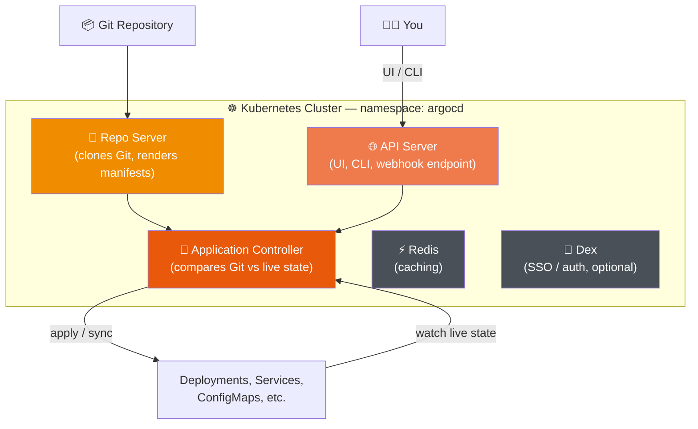

- **API Server** — the front door. The UI and CLI both talk to it.
- **Repo Server** — clones your Git repo and renders the final Kubernetes YAML (handles Helm templating, Kustomize overlays, plain YAML, Jsonnet).
- **Application Controller** — the brain. Continuously **diffs** what's in Git against what's actually running in the cluster, and triggers a sync when they drift apart.
- **Redis** — caching layer, keeps things fast.
- **Dex** — optional, handles SSO logins (GitHub, Google, LDAP, OIDC).

---

## Core Concepts You Must Know

| Term | Meaning |
|---|---|
| **Application** | The core ArgoCD object — maps *one* Git source (a path in a repo) to *one* destination (a namespace in a cluster) |
| **Project (AppProject)** | A way to group Applications and apply guardrails (which repos, which clusters, which resource types are allowed) |
| **Source** | Where the manifests come from — a Git repo path, a Helm chart, or a Kustomize overlay |
| **Destination** | Which cluster + namespace the Application deploys into |
| **Sync** | The act of applying Git's desired state onto the cluster |
| **Sync Policy** | Manual (you click "Sync") or Automated (ArgoCD syncs by itself whenever Git changes) |
| **Health Status** | Is the app actually *working*? (Healthy, Degraded, Progressing, Missing) |
| **Sync Status** | Does the cluster *match* Git? (Synced, OutOfSync) |

> [!IMPORTANT]
> **Sync Status** and **Health Status** are two completely different things. An app can be perfectly **Synced** (cluster matches Git exactly) but still **Degraded** (a pod is crash-looping) — because the YAML itself was broken. Always check both.

---

## Installing ArgoCD From Scratch

You need a working Kubernetes cluster first (Minikube, Kind, EKS, GKE, AKS — anything works). Then:

### Step 1: Create a namespace for ArgoCD

```bash
kubectl create namespace argocd
```

### Step 2: Install ArgoCD

```bash
kubectl apply -n argocd -f https://raw.githubusercontent.com/argoproj/argo-cd/stable/manifests/install.yaml
```

This installs every component shown in the architecture diagram above — API server, repo server, controller, Redis, and Dex — as pods in the `argocd` namespace.

### Step 3: Watch the pods come up

```bash
kubectl get pods -n argocd -w
```

Wait until everything shows `Running` / `1/1` — this usually takes 1–3 minutes.

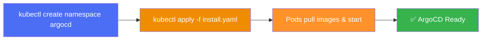

> [!TIP]
> For production clusters, most teams instead install ArgoCD via its **official Helm chart** — it gives you far more configuration control (HA mode, resource limits, ingress, SSO) than the raw manifest.
> ```bash
> helm repo add argo https://argoproj.github.io/argo-helm
> helm install argocd argo/argo-cd -n argocd --create-namespace
> ```

---

## Accessing the ArgoCD UI

By default, the `argocd-server` service isn't exposed outside the cluster. The quickest way to reach it locally:

```bash
kubectl port-forward svc/argocd-server -n argocd 8080:443
```

Now open **https://localhost:8080** in your browser (you'll get a self-signed certificate warning — that's expected for local setups; accept it).

### Getting the initial admin password

ArgoCD auto-generates an admin password on first install, stored as a Kubernetes secret:

```bash
kubectl -n argocd get secret argocd-initial-admin-secret \
  -o jsonpath="{.data.password}" | base64 -d
```

Login with:
- **Username:** `admin`
- **Password:** *(the output of the command above)*

> [!WARNING]
> Change this password immediately after your first login (**User Info → Update Password** in the UI, or `argocd account update-password` via CLI). Never leave the auto-generated password in place on a real cluster.

For production, you'd instead expose ArgoCD through an **Ingress** or **LoadBalancer**, not `port-forward`.

---

## Installing the ArgoCD CLI

The CLI lets you do everything the UI does, but scriptable — essential for automation.

```bash
# macOS
brew install argocd

# Linux
curl -sSL -o argocd https://github.com/argoproj/argo-cd/releases/latest/download/argocd-linux-amd64
sudo install -m 555 argocd /usr/local/bin/argocd
rm argocd
```

Log in from the CLI:

```bash
argocd login localhost:8080 --username admin --password <your-password> --insecure
```

---

## Your First Application — Step by Step

Let's deploy a simple app. ArgoCD's official Guestbook demo app is the classic "hello world" here.

### Option A: Using the CLI

```bash
argocd app create guestbook \
  --repo https://github.com/argoproj/argocd-example-apps.git \
  --path guestbook \
  --dest-server https://kubernetes.default.svc \
  --dest-namespace default
```

Then sync it:

```bash
argocd app sync guestbook
```

### Option B: Using a declarative YAML manifest (recommended — this is itself GitOps!)

Create `guestbook-app.yaml`:

```yaml
apiVersion: argoproj.io/v1alpha1
kind: Application
metadata:
  name: guestbook
  namespace: argocd
spec:
  project: default
  source:
    repoURL: https://github.com/argoproj/argocd-example-apps.git
    targetRevision: HEAD
    path: guestbook
  destination:
    server: https://kubernetes.default.svc
    namespace: default
  syncPolicy:
    automated:
      prune: true
      selfHeal: true
```

Apply it directly:

```bash
kubectl apply -f guestbook-app.yaml -n argocd
```

> [!TIP]
> This second method is the real-world best practice: **the Application definition itself lives in Git too.** You never manually `argocd app create` in production — you commit the Application YAML and let it flow in through your own GitOps pipeline. This is the seed of the "App of Apps" pattern below.


---

## Understanding Sync Policies

This is the single most important setting in ArgoCD.

### Manual Sync (default)

Git changes, but **ArgoCD waits for a human** to click "Sync" in the UI (or run `argocd app sync`) before touching the cluster.

```yaml
syncPolicy: {}   # nothing set = manual
```

### Automated Sync

ArgoCD syncs **by itself**, within seconds of detecting a Git change:

```yaml
syncPolicy:
  automated:
    prune: true       # delete cluster resources that were removed from Git
    selfHeal: true     # revert any manual kubectl edits back to match Git
```

| Option | What it does |
|---|---|
| `automated` (empty) | Auto-sync on Git changes, but leaves manually-added resources alone |
| `prune: true` | Also **delete** resources from the cluster if they're removed from Git |
| `selfHeal: true` | If someone manually edits the cluster with `kubectl edit`, ArgoCD reverts it back to match Git |

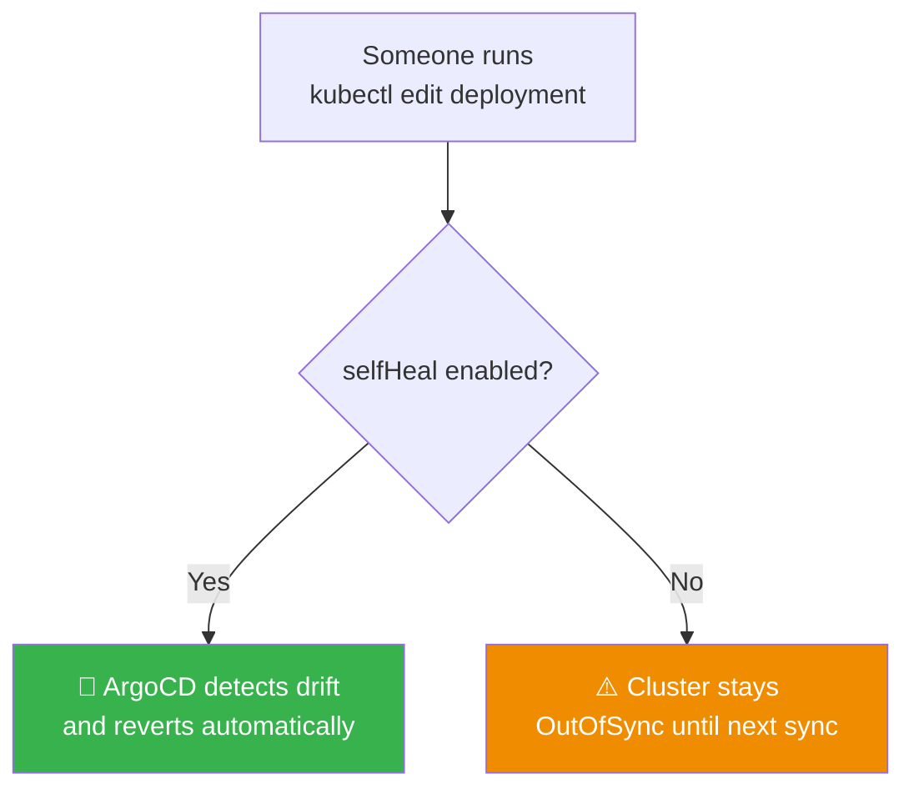

> [!IMPORTANT]
> `selfHeal: true` is what makes ArgoCD genuinely powerful — it means **Git is not just a suggestion, it's enforced**. Nobody can silently drift the cluster away from what's committed, even by accident.

---

## Sync Status vs Health Status

Every Application shows two independent badges in the UI:

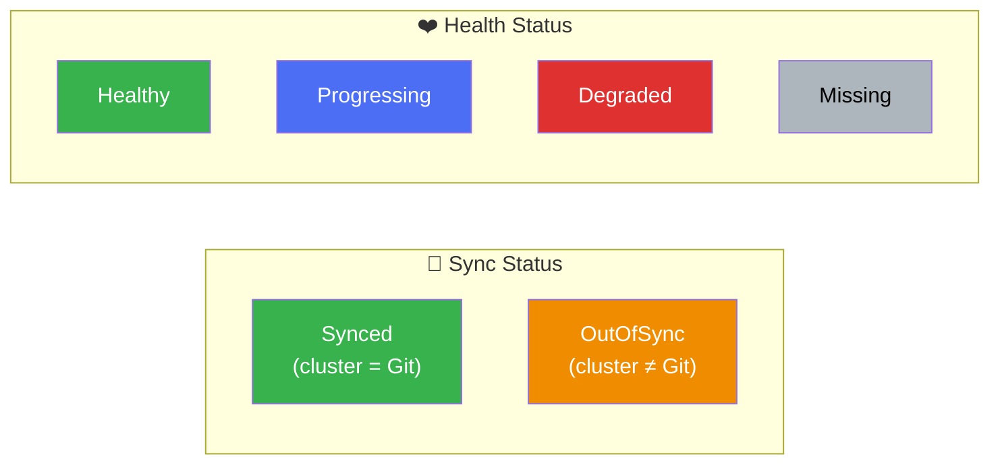

A healthy production app should show **Synced + Healthy**. Anything else needs a look.

---

## The "App of Apps" Pattern

As you grow past one or two Applications, you don't want to manually create each one. Instead, you create **one parent Application whose entire job is to manage a folder full of other Application manifests.**

```
gitops-repo/
└── apps/
    ├── root-app.yaml         👈 the "App of Apps" — points here
    ├── frontend-app.yaml
    ├── backend-app.yaml
    ├── database-app.yaml
    └── monitoring-app.yaml
```

```yaml
# root-app.yaml
apiVersion: argoproj.io/v1alpha1
kind: Application
metadata:
  name: root-app
  namespace: argocd
spec:
  project: default
  source:
    repoURL: https://github.com/myorg/gitops-repo.git
    path: apps
    targetRevision: HEAD
  destination:
    server: https://kubernetes.default.svc
    namespace: argocd
  syncPolicy:
    automated:
      prune: true
      selfHeal: true
```

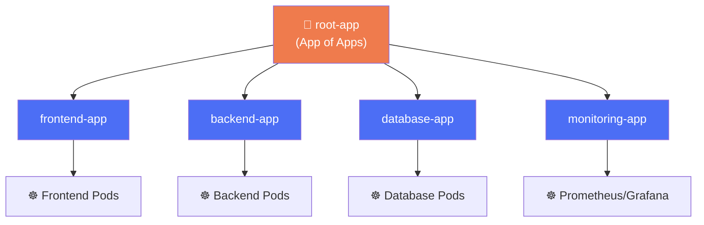

Now, bootstrapping a **brand-new cluster** is one command: apply `root-app.yaml`, and ArgoCD cascades and deploys your *entire* platform automatically.

---

## ApplicationSets — Managing Many Apps/Clusters

The **App of Apps** pattern is great for a handful of apps you list by hand. But what if you have **20 microservices** or need to deploy the **same app to 5 different clusters**? Writing 20 (or 5) near-identical YAML files is tedious and error-prone.

**ApplicationSet** solves this with **generators** — templates that stamp out Applications automatically.

### Example: Deploy the same app to multiple clusters

```yaml
apiVersion: argoproj.io/v1alpha1
kind: ApplicationSet
metadata:
  name: my-app-fleet
  namespace: argocd
spec:
  generators:
    - clusters: {}   # auto-discovers every cluster registered with ArgoCD
  template:
    metadata:
      name: '{{name}}-my-app'
    spec:
      project: default
      source:
        repoURL: https://github.com/myorg/my-app.git
        targetRevision: HEAD
        path: manifests
      destination:
        server: '{{server}}'
        namespace: my-app
      syncPolicy:
        automated:
          prune: true
          selfHeal: true
```

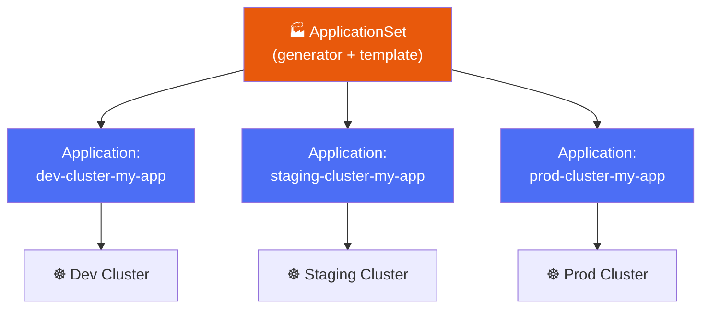

> [!TIP]
> Other common generators: **Git directory generator** (one Application per folder in a repo — great for monorepos), **Git file generator** (read cluster lists from a JSON/YAML file), and **Pull Request generator** (auto-create a preview Application for every open PR!).

---

## Sync Waves & Hooks — Ordering Your Deployment

Sometimes order matters — a database migration must run *before* the app starts, or a namespace must exist *before* anything else deploys. ArgoCD handles this with **Sync Waves** (ordering) and **Hooks** (lifecycle actions).

```yaml
metadata:
  annotations:
    argocd.argoproj.io/sync-wave: "-1"    # negative = runs earlier
```

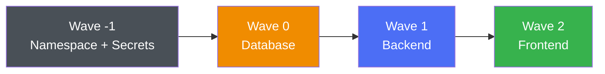

**Hooks** run one-off Jobs at specific points in the sync lifecycle:

```yaml
metadata:
  annotations:
    argocd.argoproj.io/hook: PreSync   # also: PostSync, SyncFail
```

Common use: a `PreSync` hook that runs `kubectl exec ... -- python manage.py migrate` before the new app version rolls out.

---

## Real-World Use Case 1: Dev → Staging → Prod

The most common real-world setup: **one Git repo (or branch/folder structure) per environment**, each with its own ArgoCD Application.

```
gitops-repo/
├── apps/
│   ├── dev/
│   │   └── values.yaml      (replicas: 1, small resources)
│   ├── staging/
│   │   └── values.yaml      (replicas: 2)
│   └── prod/
│       └── values.yaml      (replicas: 5, autoscaling on)
```

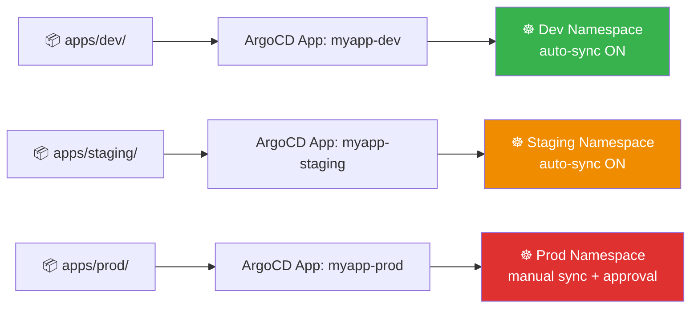

**Typical policy:** `dev` and `staging` auto-sync instantly on every commit. `prod` stays on **manual sync**, so a human explicitly clicks "Sync" (or approves a PR that merges into a `prod` branch) before anything touches production. This gives you full automation *and* a safety gate, in the same tool.

---

## Real-World Use Case 2: Multi-Cluster Fleet Management

A platform team running Kubernetes across **multiple regions** (or multiple customer clusters, in a SaaS setup) registers every cluster with one central ArgoCD instance:

```bash
argocd cluster add my-eks-context-name
```

Then a single **ApplicationSet** (shown earlier) fans out the same baseline stack — ingress controller, monitoring, logging agents — to every cluster automatically.

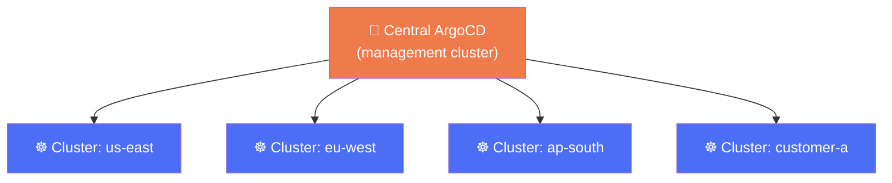

This is a very common pattern for platform/DevOps teams at mid-to-large companies — one Git commit updates the baseline config for *every* cluster in the fleet simultaneously.

---

## Real-World Use Case 3: Microservices Monorepo

Say you have 15 microservices, each with its own folder in one repo. Instead of writing 15 Application YAMLs, use ApplicationSet's **Git directory generator**:

```yaml
apiVersion: argoproj.io/v1alpha1
kind: ApplicationSet
metadata:
  name: microservices
  namespace: argocd
spec:
  generators:
    - git:
        repoURL: https://github.com/myorg/microservices-repo.git
        revision: HEAD
        directories:
          - path: services/*
  template:
    metadata:
      name: '{{path.basename}}'
    spec:
      project: default
      source:
        repoURL: https://github.com/myorg/microservices-repo.git
        targetRevision: HEAD
        path: '{{path}}'
      destination:
        server: https://kubernetes.default.svc
        namespace: '{{path.basename}}'
      syncPolicy:
        automated:
          prune: true
          selfHeal: true
```

Every folder under `services/` automatically becomes its own ArgoCD Application — add a new microservice folder, and a new Application (and namespace) appears with zero manual ArgoCD configuration.

---

## Real-World Use Case 4: Canary / Blue-Green with Argo Rollouts

Plain Kubernetes `Deployments` only support basic rolling updates. For **canary releases** (shift 10% of traffic, watch metrics, then shift more) or **blue-green deployments**, teams pair ArgoCD with its sister project, **Argo Rollouts**.

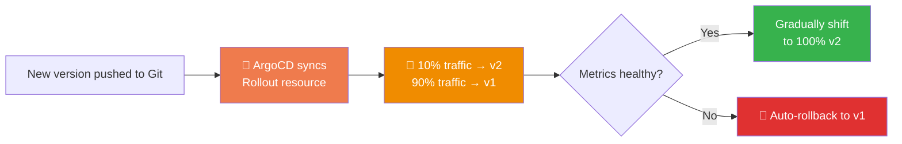

ArgoCD's job stays exactly the same — sync Git to cluster. Argo Rollouts just replaces the plain `Deployment` object with a smarter `Rollout` object that knows how to progressively shift traffic and auto-analyze metrics (via Prometheus, Datadog, etc.) before fully committing to the new version.

---

## ArgoCD vs Jenkins vs GitHub Actions — When to Use What

This is the question almost everyone asks — and the honest answer is: **they're not competitors, they solve different halves of the pipeline.**

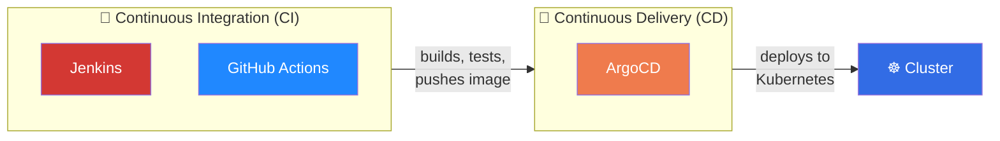

| Question | Jenkins | GitHub Actions | ArgoCD |
|---|---|---|---|
| What is it for? | General-purpose CI/CD automation server | Native GitHub CI/CD automation | Kubernetes-specific GitOps continuous **delivery** |
| Where does it run? | Your own server/VM (self-hosted) | GitHub-hosted or self-hosted runners | Inside your Kubernetes cluster |
| Can it build Docker images? | ✅ Yes | ✅ Yes | ❌ No — not its job |
| Can it run tests? | ✅ Yes | ✅ Yes | ❌ No — not its job |
| Can it deploy to Kubernetes? | ✅ Yes (via `kubectl`, needs creds) | ✅ Yes (via `kubectl`, needs creds) | ✅ Yes — this is its **only** job, done right |
| Does it need cluster credentials outside the cluster? | Yes, if deploying | Yes, if deploying | No — runs *inside* the cluster |
| Self-healing drift detection? | ❌ No | ❌ No | ✅ Yes (`selfHeal: true`) |
| Visual diff of desired vs live state? | ❌ No | ❌ No | ✅ Yes, built into the UI |
| Best for | Complex, custom, plugin-heavy pipelines; non-K8s deployments too | Simple, GitHub-native CI, small-to-mid teams | Any team deploying to Kubernetes who wants safe, auditable, automatic delivery |

### The simple rule of thumb:

> [!TIP]
> **Jenkins and GitHub Actions answer: "Is my code good, and can I package it?"**
> **ArgoCD answers: "Is what's running in my cluster exactly what I intended?"**
>
> Use Jenkins or GitHub Actions for **CI** (build, test, package, push image). Use ArgoCD for **CD into Kubernetes**. Most mature Kubernetes shops run **both**, not either/or.

---

## The Hybrid Pattern: CI Tool + ArgoCD Together

This is how it actually works in production. Two separate Git repos are common (though one repo works too):

- **App repo** — your application source code
- **GitOps/infra repo** — Kubernetes manifests, Helm values, image tags

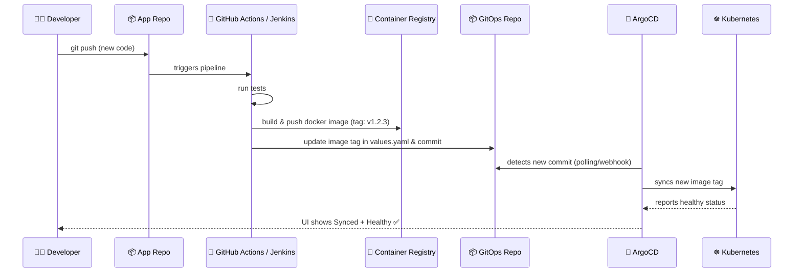

Notice: **the CI tool never touches the cluster.** Its last action is simply `git commit` to the GitOps repo. ArgoCD takes it from there — this separation is the entire point of GitOps.

---

## Full Worked Example: GitHub Actions + ArgoCD Pipeline

**Step 1 — GitHub Actions builds and pushes the image, then updates the GitOps repo:**

```yaml
name: Build and Release

on:
  push:
    branches: [main]

jobs:
  build-and-release:
    runs-on: ubuntu-latest
    steps:
      - name: Checkout app code
        uses: actions/checkout@v4

      - name: Log in to Docker Hub
        uses: docker/login-action@v3
        with:
          username: ${{ secrets.DOCKERHUB_USERNAME }}
          password: ${{ secrets.DOCKERHUB_TOKEN }}

      - name: Build and push image
        uses: docker/build-push-action@v5
        with:
          push: true
          tags: myorg/myapp:${{ github.sha }}

      - name: Checkout GitOps repo
        uses: actions/checkout@v4
        with:
          repository: myorg/gitops-repo
          token: ${{ secrets.GITOPS_REPO_TOKEN }}
          path: gitops-repo

      - name: Update image tag
        run: |
          cd gitops-repo
          sed -i "s/tag:.*/tag: ${{ github.sha }}/" apps/myapp/values.yaml
          git config user.name "github-actions"
          git config user.email "actions@github.com"
          git commit -am "chore: bump myapp to ${{ github.sha }}"
          git push
```

**Step 2 — ArgoCD Application watching that GitOps repo (already configured, does the rest automatically):**

```yaml
apiVersion: argoproj.io/v1alpha1
kind: Application
metadata:
  name: myapp
  namespace: argocd
spec:
  project: default
  source:
    repoURL: https://github.com/myorg/gitops-repo.git
    path: apps/myapp
    targetRevision: HEAD
    helm:
      valueFiles:
        - values.yaml
  destination:
    server: https://kubernetes.default.svc
    namespace: myapp
  syncPolicy:
    automated:
      prune: true
      selfHeal: true
```

That's the entire pipeline. From `git push` on the app repo to a running pod in production, **zero manual `kubectl` commands** are ever needed — and every single change is fully traceable through Git history in both repos.

---

## Notifications (Slack, Email, etc.)

ArgoCD ships an optional **Notifications** controller that can alert you on sync/health events:

```yaml
# argocd-notifications-cm ConfigMap (partial example)
apiVersion: v1
kind: ConfigMap
metadata:
  name: argocd-notifications-cm
  namespace: argocd
data:
  service.slack: |
    token: $slack-token
  template.app-sync-succeeded: |
    message: "✅ {{.app.metadata.name}} synced successfully!"
  trigger.on-sync-succeeded: |
    - when: app.status.operationState.phase in ['Succeeded']
      send: [app-sync-succeeded]
```

Then annotate your Application to subscribe:

```yaml
metadata:
  annotations:
    notifications.argoproj.io/subscribe.on-sync-succeeded.slack: my-channel
```

---

## RBAC & SSO

For real teams, `admin`-for-everyone doesn't scale. ArgoCD supports:

- **SSO** via Dex (GitHub, Google, GitLab, LDAP, OIDC) — configured in the `argocd-cm` ConfigMap.
- **RBAC** via the `argocd-rbac-cm` ConfigMap, mapping users/groups to roles:

```yaml
policy.csv: |
  p, role:developer, applications, sync, default/*, allow
  p, role:developer, applications, get, default/*, allow
  g, my-github-org:dev-team, role:developer
```

This lets you give, say, a `dev-team` group permission to **sync** apps in the `default` project, without giving them full admin control over ArgoCD itself.

---

## Security Best Practices

> [!IMPORTANT]
> ArgoCD effectively holds the keys to your cluster's actual state. Treat it with production-grade care.

1. **Change the default admin password immediately** and prefer SSO over local accounts for real users.
2. **Use AppProjects to restrict scope** — limit which Git repos, clusters, and namespaces each team's Applications can touch.
3. **Never commit plaintext secrets to your GitOps repo.** Use **Sealed Secrets**, **External Secrets Operator**, or **SOPS** to encrypt secrets before they land in Git.
4. **Keep `prod` on manual sync (or require PR approval)** even if `dev`/`staging` are fully automated — a human checkpoint before production matters.
5. **Enable `selfHeal`** on everything below prod — it prevents silent configuration drift caused by manual `kubectl` edits.
6. **Restrict ArgoCD's own RBAC** — don't give every developer cluster-admin-equivalent access just because they can reach the ArgoCD UI.
7. **Expose the UI behind SSO + Ingress + TLS** in real environments — never leave `port-forward`-only access as your production setup.

---

## Debugging: My App is OutOfSync / Degraded

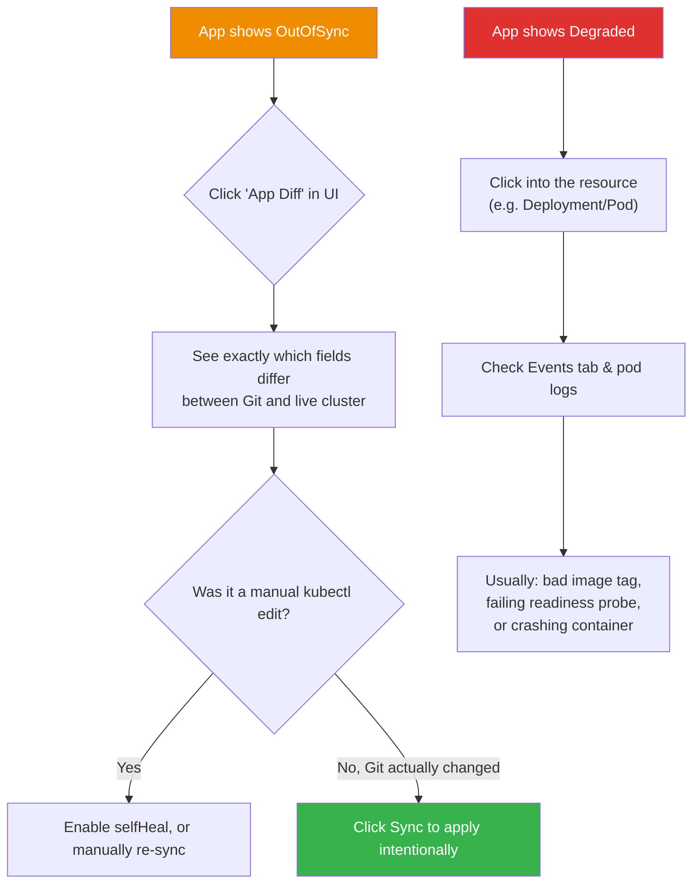

Useful CLI commands while debugging:

```bash
argocd app get myapp              # full status, sync state, resource tree
argocd app diff myapp             # exact diff between Git and live cluster
argocd app logs myapp             # pod logs, right from the CLI
argocd app history myapp          # every past sync, for rollback
argocd app rollback myapp <ID>    # roll back to a previous synced revision
```

---

## Cheat Sheet

```bash
# Install
kubectl create namespace argocd
kubectl apply -n argocd -f https://raw.githubusercontent.com/argoproj/argo-cd/stable/manifests/install.yaml

# Access UI locally
kubectl port-forward svc/argocd-server -n argocd 8080:443

# Get initial admin password
kubectl -n argocd get secret argocd-initial-admin-secret -o jsonpath="{.data.password}" | base64 -d

# CLI login
argocd login localhost:8080 --username admin --password <pwd> --insecure

# Create an app
argocd app create <name> --repo <git-url> --path <path> --dest-server https://kubernetes.default.svc --dest-namespace <ns>

# Sync manually
argocd app sync <name>

# List all apps
argocd app list

# Diff Git vs live cluster
argocd app diff <name>

# View sync history / rollback
argocd app history <name>
argocd app rollback <name> <history-id>

# Auto-sync YAML block
syncPolicy:
  automated:
    prune: true
    selfHeal: true
```

---

### 🎯 The Core Idea, In One Sentence

> **ArgoCD doesn't build or test your code — it guarantees that whatever is committed to Git is exactly what's running in Kubernetes, continuously and automatically, with a full audit trail and instant rollback.**

Pair it with Jenkins or GitHub Actions for the "build & test" half, and you get a complete, production-grade CI/CD pipeline: **CI tool ships the artifact → Git records the intent → ArgoCD makes it real.**
